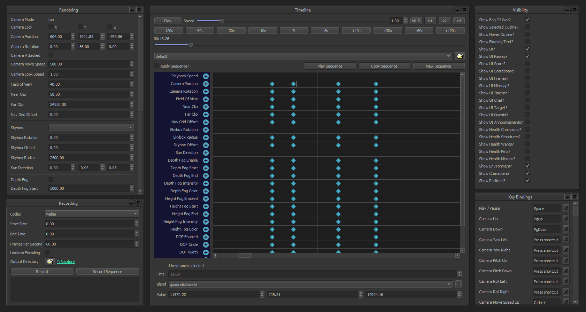

## League Director
[](https://github.com/riotgames/leaguedirector/blob/master/LICENSE)
[](https://www.python.org/downloads/release/python-372/)
[](https://www.qt.io/qt-for-python)
[](https://discord.gg/7j5fdRp)

League Director is a tool for staging and recording videos from League of Legends replays. **[Download Latest Release](https://github.com/riotgames/leaguedirector/releases/latest)**



## Features

* Control replay playback and speed
* First person camera controls
* Attach camera to champion or minion
* Toggle interface elements including HUD, health bars and notifications
* Graphical Options
  - Field of view
  - Near and far clipping
  - Custom skyboxes
  - Shadow direction
  - Depth and height fog
  - Depth of field
* Sequencer
  - Record and playback keyframed camera position + graphical options
  - Timeline for viewing and editing keyframe values
  - Undo / Redo
  - Save and load pre saved sequences
  - Adjustable keyframe blending
* Video capture in webm or png format
* Customizable key bindings

## How To Use

**Note: Windows Only**

1. **[Download League Director](https://github.com/riotgames/leaguedirector/releases/latest)** from the releases page and install.
2. Start League Director and make sure the checkbox next to your install is checked.
3. Start League of Legends and launch a replay. League Director will automatically connect.
4. Open the options menu (ESC key) in game and set your Video Graphics setting to Very High.
5. Select FPS Camera from the Camera Modes drop down in game.
6. Using the numpad keys (4, 5, 6, 8) and the mouse you can free camera move around. Key bindings for free camera can also be changed inside the game options.

## Tutorials
Introduction | Walkthrough
------------ | -------------
[](https://www.youtube.com/watch?v=bzqydcrw89A "League Director Intro")|[](https://www.youtube.com/watch?v=KuHLaDRReRU "League Director Tutorial")

## Frequently Asked Questions
TODO

## Developing
To run the source version of this application you need the [latest 3.7.2 version](https://www.python.org/downloads/release/python-372/)  of Python installed. From the windows command line:

```
# Clone this repository
$ git clone https://github.com/riotgames/leaguedirector.git

# Change directory
$ cd leaguedirector

# Run the startup script
$ run.bat
```

The run batch file will setup a virtual environment using [Pipenv](https://pipenv.readthedocs.io/en/latest/) and install required dependencies such as [Qt](https://www.qt.io/qt-for-python).

_League Director is being release by Riot Games as a reference implementation for the [Replay API](https://developer.riotgames.com/replay-apis.html). You are free to download and modify this source code or create your own fork of the project but we will not be accepting pull requests at this time._

## License
Apache 2 (see [LICENSE](https://github.com/riotgames/leaguedirector/blob/master/LICENSE) for details)

For usage rights of Riot Games intellectual property, such as the skybox textures bundled with this installer, please refer to:

[https://www.riotgames.com/en/legal](https://www.riotgames.com/en/legal)

This project makes used of LGPL licensed software [QT for Python](https://doc.qt.io/qtforpython/licenses.html).

## Special Thanks
 * Skin Spotlights
 * League of Editing
